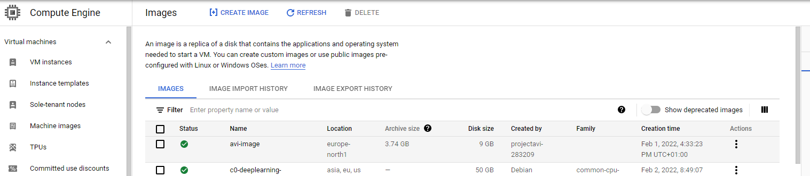

# tfAviGcp

## Goals
Spin up a full Gcp/Avi environment (through Terraform)

## Prerequisites:
- Terraform installed in the orchestrator VM
- Avi credentials configured as environment variables:
```
export TF_VAR_avi_username="admin"
export TF_VAR_avi_password="*****"
export TF_VAR_avi_old_password="*****"
```
- GCP credential/details are configured as environment variable:
```
GOOGLE_CLOUD_KEYFILE_JSON=**************
```
- GCP Avi Controller image configured in GCP: name of this image should be configured as var.controller.avi_image


- SSH Key (public and private) paths defined in var.ssh_key.public and var.ssh_key.private 


## versions:

### terraform
```
Terraform v1.1.4
on linux_amd64
+ provider registry.terraform.io/hashicorp/google v4.8.0
+ provider registry.terraform.io/hashicorp/null v3.1.0
+ provider registry.terraform.io/hashicorp/template v2.2.0
```

### Avi version
```
Avi 21.1.3 with a standalone controller
```

### GCP Region:
- europe-north1

## Input/Parameters:

- All the variables are stored in variables.tf

## Use the the terraform script to:
- Create the VPC and subnets with a cloud NAT service for the private subnets
- Spin up 2 backend servers (second subnet) across the 3 zones - no NAT public IP - apache deployed through userdata
- Spin up a jump server with ansible in the mgt subnet (first subnet) - NAT Public IP - ansible through userdata
- Create a GCP storage bucket
- Spin up an Avi controller (in the first subnet) based on the avi image needed as a prerequisite
- Call ansible to do the configuration (avi) based on dynamic inventory

## Run the terraform:
```
cd ~ ; git clone https://github.com/tacobayle/tfAviGcp ; cd tfAviGcp ; terraform init ; terraform apply -auto-approve
# the terraform will output the command to destroy the environment.
```
